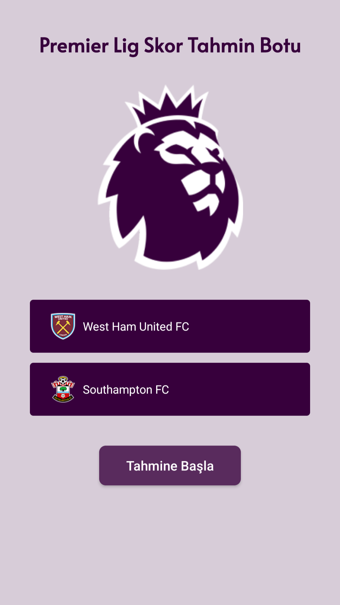
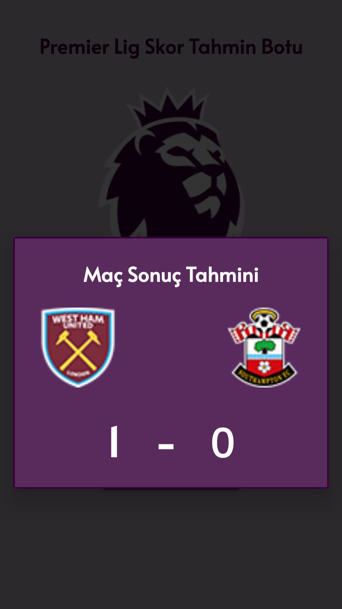

#  Bitirme Projesi: Premier Lig Skor Tahmin Sistemi

Bu proje, Premier Lig maç sonuçlarını tahmin etmek için makine öğrenmesi kullanılan bir sistemdir. Proje iki ana bileşenden oluşur:

-  **Flask API (Python)**: Maç sonucu ve skor tahmini için eğitilmiş modelleri barındırır.
-  **Android Uygulama**: Kullanıcının maç tahmini yapabilmesi için arayüz sağlar. Retrofit kullanılarak API'ye istek yapılır.

---

##  Proje Yapısı

```
GuessScore/
├── flask-api/          # Python Flask API (backend)
│   ├── app.py
│   ├── model.pkl
│   ├── requirements.txt
│   └── ...
├── android-app/        # Android uygulaması (client)
│   ├── app/
│   ├── build.gradle
│   └── ...
└── README.md           
```

---

## Özellikler

- Premier Lig geçmiş verileriyle eğitilmiş ML modeli (RandomForest)
- Gol tahmini (regresyon) ve maç sonucu tahmini (sınıflandırma)
- Android üzerinden maç tahmini yapılabilen kullanıcı arayüzü
- Railway üzerinde barındırılan canlı API servisi
- JSON tabanlı veri alışverişi

---

##  Kurulum

### 1. Flask API (Backend)

#### 🔹 Yerel Çalıştırmak için

```bash
cd flask-api
pip install -r requirements.txt
python app.py
```

#### 🔹 Railway Üzerinden Yayın

Backend, Railway platformunda şu adreste yayınlanmaktadır:

```
https://guessscoreapi-production.up.railway.app/
```

> `flask-api` klasörü Railway'de root klasör olarak ayarlanmıştır.

---

### 2. Android Uygulama (Frontend)

#### 🔹 Gerekli Ayarlar
- `Retrofit` içinde API base URL olarak Railway endpoint'ini kullan:
```
https://guessscoreapi-production.up.railway.app/
```

#### 🔹 Çalıştırmak için
1. Android Studio ile `android-app` klasörünü aç.
2. Gerekli izinleri ve API bağlantılarını yapılandır.
3. Emulator veya fiziksel cihazda çalıştır.

---

##  API Endpointleri

### 🔹 `POST /predict`

```bash
curl -X POST https://guessscoreapi-production.up.railway.app/predict -H "Content-Type: application/json" -d '{"home_team": "Arsenal FC", "away_team": "Chelsea FC"}'
```

#### Örnek Yanıt:
```json
{
	"away_team":"Chelsea FC",
	"home_team":"Arsenal FC",
	"predicted_away_score":1,
	"predicted_home_score":2,
	"predicted_result":"home_win"
}
```

---

##  Ekran Görüntüleri

| Android Uygulama                  | API JSON Cevabı                     |
| --------------------------------- | ----------------------------------- |
|  |  |

---

##  Kullanılan Teknolojiler

| Katman         | Teknoloji                          |
|----------------|------------------------------------|
| Backend        | Python, Flask 					  |
| Frontend       | Java/Kotlin, Android SDK, Retrofit |
| M. Learning    | Python, Scikit-Learn        		  |
| Hosting        | Railway                            |
| Model          | RandomForestRegressor, Classifier  |
| Database       | CSV / Pandas tabanlı veri işleme   |

---

##  Geliştirici

**Alperen Oğuz Küçükçal**  

📧 [alperenoguzkucukcal@gmail.com](mailto:alperenoguzkucukcal@gmail.com) 
🔗 [LinkedIn](https://www.linkedin.com/in/alperen-oguz-kucukcal/)